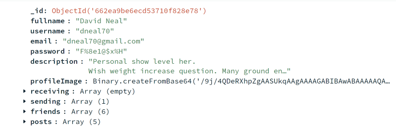
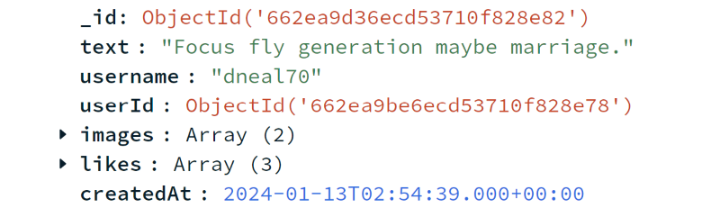
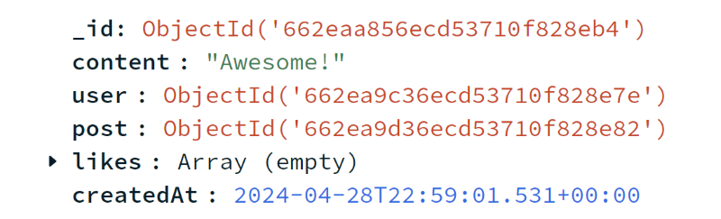
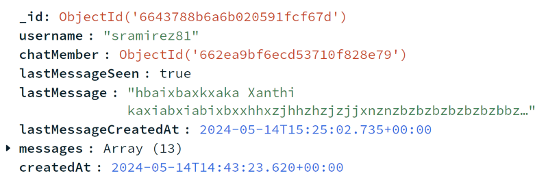
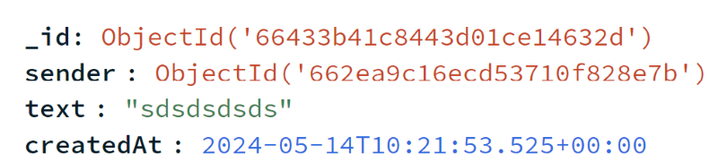
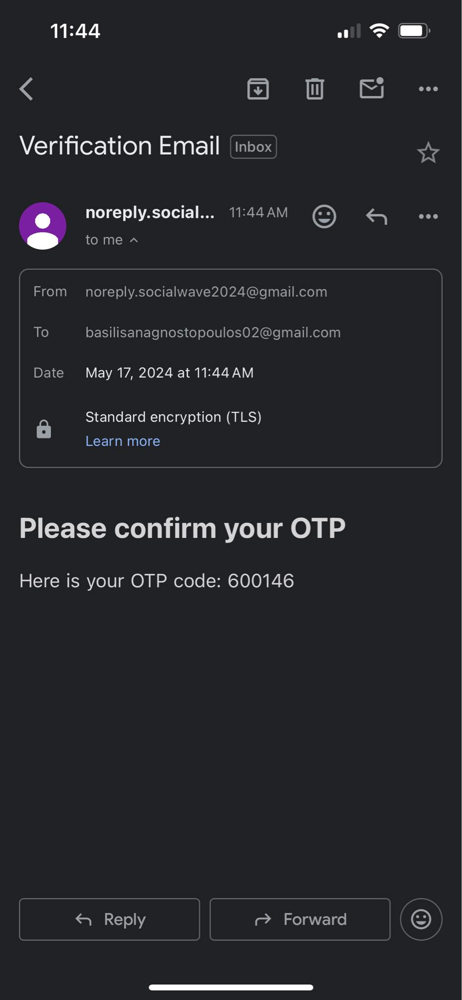
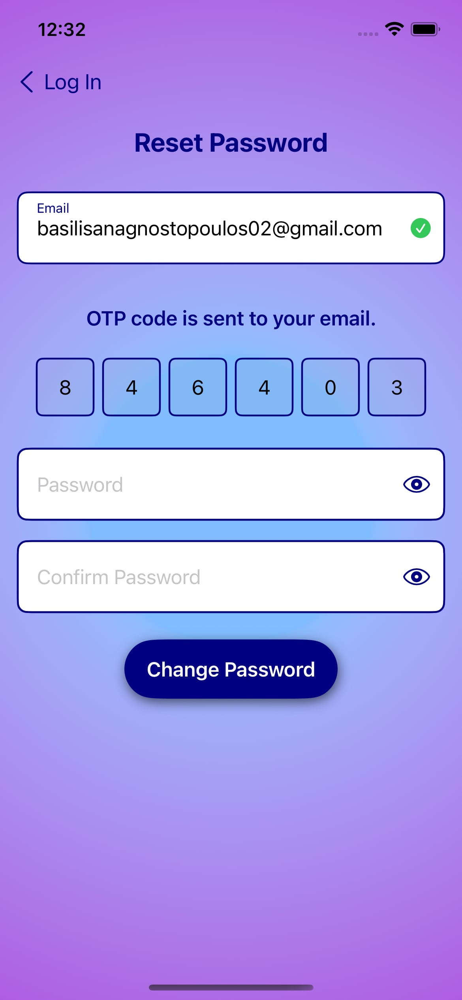

# SocialWave iOS App

SocialWave is a fully functional iOS social media application developed using SwiftUI in Xcode, with a Node.js server as its backend, connected to a MongoDB database. This application allows users to create accounts, make posts, comment, like, and communicate with friends through chat. It also features OTP authentication, automatic login with JWT, friend suggestions, and real-time notifications.

## Table of Contents

- [Installation](#installation)
- [Features](#features)
- [Technologies Used](#technologies-used)
- [Folder Structure](#folder-structure)
- [Setup](#setup)
  - [Xcode](#xcode)
  - [Node.js Server](#nodejs-server)
  - [MongoDB Database](#mongodb-database)
- [Usage](#usage)
- [Backend](#backend)
- [MongoDB Collections](#mongodb-collections)
  - [All DB Collections](#all-db-collections)
  - [User Collection Details](#user-collection-details)
  - [Post Collection Details](#post-collection-details)
  - [OTP Collection Details](#otp-collection-details)
  - [Comment Collection Details](#comment-collection-details)
  - [Chat Collection Details](#chat-collection-details)
  - [Message Collection Details](#message-collection-details)
  - [Notification Collection Details](#notification-collection-details)
- [Screenshots From The Screens Of The App](#screenshots-from-the-screens-of-the-app)

## Installation

Clone the repository to your local machine:

```bash
git clone https://github.com/vasilisanagno/SocialWave-iOS-App.git
```

## Features

- User account creation and OTP email verification
- Password recovery and update with OTP
- Friend requests, accept or reject requests
- Create, like, and comment on posts
- Real-time notifications for likes, comments, and friend requests
- Direct messaging (chat) between friends
- Friend suggestion algorithm based on mutual friends
- Secure HTTPS communication

## Technologies Used

- **Xcode** and **SwiftUI** for iOS app development
- **Node.js** for the backend server
- **MongoDB** for the database
- **Socket.IO** for real-time communication
- **JWT(JSON Web Tokens)** for authentication
- **OTP(One-Time Password)** for email verification

## Folder Structure

The project is organized as follows:

### Backend

- `backend`: Contains server-related files.
  - `src/server.js`: Main server file.
  - `src/config`: Configuration files for the database connection.
  - `src/api`: API routes and controllers for database interactions.
    - `controllers`: Functions handling API requests.
    - `models`: MongoDB models for User, Post, Comment, etc.
    - `routes`: Defines API routes.
    - `services`: Functions for database queries.
    - `socketListeners`: Contains the listeners for sockets/real-time chat and notifications.
- `creationOfDatabase`: Python script for populating the database with random data.

### Frontend

- `SocialWave`: Contains the iOS app's frontend code.
  - `SocialWave`: Main app folder.
    - `ui`: Contains SwiftUI views for different screens/shared classes.
      - `components`: UI components for screens.
      - `screens`: Views and ViewModels(logic and state management for each screen) for different screens.
    - `models`: Data models for the app that are used in the Views.
    - `data`: Handles API calls to the backend server.
      - `model`: Response Classes from the API calls.
      - `network`: Interfaces and Classes for communication with the endpoints of the backend.
      - `repository`: Classes for decoding data from services.
      - `utils`: Contains configurations for HTTPS connection.
    - `di`: Contains file for the dependency injection.
    - `utils`: Utility functions and constants.

## Setup

### Xcode

1. Open the `SocialWaveApp` project in Xcode.
2. Build and run the iOS application on a simulator or a physical device.

### Node.js Server

1. Navigate to the `backend` folder.
2. Install the required Node.js packages:

```bash
npm install
```

3. Start the server:

```bash
npm start
```

### MongoDB Database

1. Create a MongoDB Atlas account and set up a new cluster.
2. Obtain the connection string and update the `creationOfDatabase.py` script and `DatabaseConfig.js` file with your MongoDB credentials.
3. Populate the database by running:

```bash
python creationOfDatabase.py
```

## Usage

- Launch the SocialWave app on your iOS device or simulator.
- Explore features such as posting, commenting, liking, and chatting with friends.

## Backend

The backend for SocialWave is implemented using Node.js and MongoDB. The `backend` folder contains all server-side logic, including API routes, database models, and real-time communication setup.

To run the backend, follow the instructions in the [Setup](#setup) section.

## MongoDB Collections

### All DB Collections
<div align="center">
  
</div>

### User Collection Details
<div align="center">
  
</div>

### Post Collection Details
<div align="center">
  
</div>

### OTP Collection Details
<div align="center">
  
</div>

### Comment Collection Details
<div align="center">
  
</div>

### Chat Collection Details
<div align="center">
  
</div>

### Message Collection Details
<div align="center">
  
</div>

### Notification Collection Details
<div align="center">
  
</div>

## Screenshots From The Screens Of The App

<div float="left">
  
  
  
  
</div>

<div float="left">
  
  
  
  
</div>

<div float="left">
  
  
  
  
</div>

<div float="left">
  
  
  
  
</div>

<div float="left">
  
  
  
  
</div>

<div float="left">
  
  
  
</div>